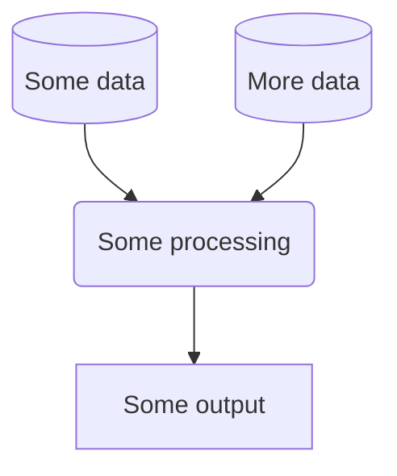

# Repository name

<!-- TOC -->
- [Introduction](#introduction)
  - [About](#about)
  - [Installation](#installation)
  - [Usage](#usage)
  - [Workflow](#workflow)
- [Data Science Campus](#data-science-campus)
- [License](#license)
<!-- /TOC -->

# Introduction
## About 
Describe what this repo contains. 

## Installation 
**Note: Delete section if not applicable, but can be useful to describe set-up. Such as the required dependencies.**

## Usage 
**Note: Delete section if not applicable, 
but generaly you need to explain how to use the things in the repo**

## Workflow
You may wish to consider generating a graph to show your project workflow. GitHub markdown provides native support for [mermaid](https://mermaid.js.org/syntax/flowchart.html), an example of which is provided below:

# Data Science Campus
At the [Data Science Campus](https://datasciencecampus.ons.gov.uk/about-us/) we apply data science, and build skills, for public good across the UK and internationally. Get in touch with the Campus at [datasciencecampus@ons.gov.uk](datasciencecampus@ons.gov.uk).

# License

<!-- Unless stated otherwise, the codebase is released under [the MIT Licence][mit]. -->

The code, unless otherwise stated, is released under [the MIT Licence][mit].

The documentation for this work is subject to [© Crown copyright][copyright] and is available under the terms of the [Open Government 3.0][ogl] licence.

[mit]: LICENCE
[copyright]: http://www.nationalarchives.gov.uk/information-management/re-using-public-sector-information/uk-government-licensing-framework/crown-copyright/
[ogl]: http://www.nationalarchives.gov.uk/doc/open-government-licence/version/3/
